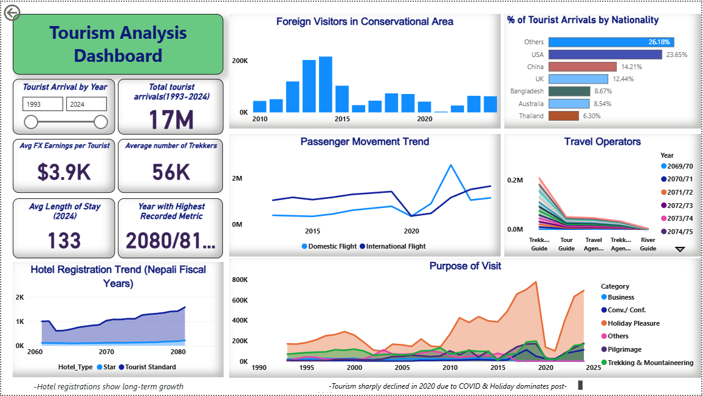

# Nepal Tourism Data Analysis Project

## Project Description
This project analyzes Nepal's official tourism statistics (2012-2024) obtained from Open Data Nepal. The dataset includes comprehensive tourism metrics such as arrivals, demographics, nationalities, purpose of visit, entry points, and aviation movement data.



## Data Source
**Dataset:** Nepal Tourism Statistics (2012-2024)  
**Source:** https://opendatanepal.com/datasets/nepal-tourism-statistics  
**Original Publisher:** Ministry of Culture, Tourism & Civil Aviation, Nepal  
**Dataset Description:** Consolidated tourism statistics from Nepal's annual reports, cleaned and standardized into machine-readable format.

## What's in the Data
The dataset includes:
- Tourist arrivals by nationality (2012-2024)
- Monthly arrival statistics
- Demographics (age, gender)
- Purpose of visit (holiday, trekking, business, etc.)
- Entry points (airports, land borders)
- Aviation movement data
- Key tourism economic indicators

## How to Use This Repository

### 1. Get the Data
Download the CSV files from:
```
https://opendatanepal.com/datasets/nepal-tourism-statistics
```
Place all downloaded CSV files in the `datasets/` folder.

### 2. Run the Analysis
Open `Tourism_Analysis.ipynb` in Jupyter Notebook and execute the cells to:
- Merge multiple annual CSV files
- Clean and standardize the data
- Generate insights and visualizations
- Prepare data for dashboarding

### 3. Create Power BI Dashboard
Use the exported CSV files in the `powerbi/` folder to build interactive dashboards in Power BI Desktop.

## Key Analysis Areas
- Tourism recovery trends post-COVID
- Market diversification analysis
- Seasonality patterns
- Top source countries and growth rates
- Purpose of visit trends

## Notes
- This project works with the standardized dataset from Open Data Nepal
- The original data comes from Nepal Tourism Statistics annual publications
- All analysis is based on publicly available official statistics

## Requirements
See `requirements.txt` for Python dependencies.

---
*This project analyzes publicly available tourism data for research and educational purposes.*
